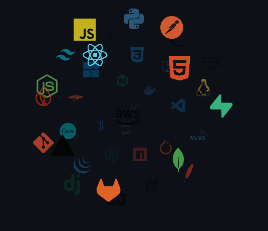

<!-- ========================================================================================== -->
<!-- HARGUN KAUR - GITHUB PROFILE README                                                        -->
<!-- Theme: Cyberpunk / Neon Futuristic Terminal (Cyan #00F5D4 • Purple #7209B7 • Magenta #F72585) -->
<!-- ========================================================================================== -->

<!-- 1. HERO HEADER BANNER -->
<p align="center">
  
</p>

<!-- DUAL CYBERPUNK TYPING ANIMATION -->
<p align="center">
  <a href="https://github.com/hargunkaur28">
    
  </a>
</p>

<!-- NEON GRADIENT DIVIDER -->
<p align="center">
  
</p>

<!-- QUICK SOCIAL BADGES -->
<p align="center">
  <a href="https://www.linkedin.com/in/hargunkaur28/" target="_blank">
    
  </a>&nbsp;
  <a href="mailto:hargungulati2004@gmail.com">
    
  </a>&nbsp;
  <a href="https://github.com/hargunkaur28">
    
  </a>&nbsp;
  <a href="https://project-eklavya.vercel.app/" target="_blank">
    
  </a>
</p>

<br />

<!-- 2. ABOUT ME SECTION -->
<table>
  <tr>
    <td width="65%" valign="top">
      <h3>⚡ System Initialization // About Me</h3>
      <p>
        I am a final-year <b>Computer Science & Engineering</b> undergraduate at <b>Lovely Professional University</b> (CGPA: 8.30) and a practical <b>Full-Stack Software Developer</b>.
      </p>
      <p>
        Having recently concluded my Web Developer Internship at <b>Avani Enterprises</b>, I specialize in engineering scalable web platforms across the <b>MERN stack</b> (MongoDB, Express.js, React.js, Node.js) and <b>Next.js</b>. My focus spans end-to-end software delivery: from crafting responsive, accessible user interfaces to designing robust RESTful APIs, role-based authorization systems, and low-latency database queries.
      </p>
      <ul>
        <li>🎓 <b>Education:</b> B.Tech in CSE @ Lovely Professional University (2023 – Present)</li>
        <li>💼 <b>Recent Experience:</b> Web Developer Intern @ Avani Enterprises</li>
        <li>🏆 <b>Key Milestones:</b> 1st Place Winner — Full-Stack Intelligent Hackathon 1.0 • SIH National Finalist (Top 50) • Intern of the Month</li>
        <li>🎯 <b>Current Target:</b> Software Engineer / Full Stack Web Developer roles & distributed systems</li>
        <li>💬 <b>Ask me about:</b> React, Next.js, Node.js, REST APIs, WebSocket concurrency, and MongoDB optimization</li>
      </ul>
    </td>
    <td width="35%" valign="middle" align="center">
      <!-- DYNAMIC SKILLS ANIMATION (Auto-adapts to Dark/Light theme on GitHub) -->
      <picture>
        <source media="(prefers-color-scheme: dark)" srcset="./Skills_Animation_Dark.gif">
        <source media="(prefers-color-scheme: light)" srcset="./Skills_Animation_White.gif">
        
      </picture>
    </td>
  </tr>
</table>

<br />

<!-- 3. CURRENT FOCUS & RADAR -->
<h3>🛰️ Active Radar // Current Engineering Focus</h3>

```bash
hargun@dev-core:~$ cat current_focus.json
{
  "focus_areas": [
    "Advanced Next.js App Router architectures & server actions",
    "Real-time event synchronization using WebSockets and Socket.io",
    "Database indexing & high-throughput query optimization with MongoDB",
    "Practical AI integrations (Groq LLM inference, Sarvam AI speech/translation models)",
    "Rigorous problem-solving & algorithmic efficiency (Data Structures & Algorithms)"
  ],
  "open_to": ["Full-Stack Developer Roles", "Software Engineering Opportunities", "Open Source Collaborations"]
}
```

<br />

<!-- 4. TECH STACK DIRECTORY -->
<h3>🛠️ Tech Stack & Tooling</h3>

<p><b>Core Languages</b></p>
<p>
  &nbsp;
  &nbsp;
  &nbsp;
  &nbsp;
  &nbsp;
  
</p>

<p><b>Frontend Engineering</b></p>
<p>
  &nbsp;
  &nbsp;
  &nbsp;
  &nbsp;
  &nbsp;
  
</p>

<p><b>Backend & Micro-APIs</b></p>
<p>
  &nbsp;
  &nbsp;
  &nbsp;
  &nbsp;
  
</p>

<p><b>Databases & Cloud Infrastructure</b></p>
<p>
  &nbsp;
  &nbsp;
  &nbsp;
  &nbsp;
  
</p>

<p><b>Developer Tools & Integrations</b></p>
<p>
  &nbsp;
  &nbsp;
  &nbsp;
  &nbsp;
  
</p>

<br />

<!-- 5. FEATURED PROJECTS -->
<h3>🚀 Featured Engineering Projects</h3>

<table>
  <thead>
    <tr>
      <th width="32%">Project</th>
      <th width="48%">Architecture & Key Problem Solved</th>
      <th width="20%">Stack & Links</th>
    </tr>
  </thead>
  <tbody>
    <!-- Project 1 -->
    <tr>
      <td>
        <b>Project Eklavya</b><br />
        <sub>AI-Powered Personalized Learning Platform</sub>
      </td>
      <td>
        • Engineered an adaptive ed-tech platform generating custom day-by-day learning roadmaps from diagnostic assessment quizzes.<br />
        • Integrated <b>Groq LLM</b> for dynamic lesson remediation and <b>Sarvam AI</b> for bilingual (English/Hindi) text-to-speech and translation.<br />
        • Features multi-role authentication (student/parent/admin), persistent AI tutor chat, and server-side PDF progress report compilation.
      </td>
      <td>
        <code>Next.js</code> <code>Node.js</code> <code>MongoDB</code> <code>Groq API</code> <code>Sarvam AI</code> <code>JWT</code><br /><br />
        <a href="https://project-eklavya.vercel.app/" target="_blank">🌐 <b>Live Demo</b></a><br />
        <a href="https://github.com/hargunkaur28" target="_blank">💻 <b>Source Code</b></a>
      </td>
    </tr>
    <!-- Project 2 -->
    <tr>
      <td>
        <b>Red Ball Sports Academy</b><br />
        <sub>Multi-Sport Complex & Arena Management</sub>
      </td>
      <td>
        • Developed an end-to-end sports facility management system supporting 3 distinct roles, QR-based contactless attendance, and court booking.<br />
        • Built a real-time restaurant ordering engine using <b>Socket.io</b>, synchronizing customer, kitchen, and administration boards instantaneously.<br />
        • Enforced secure payment workflows with <b>Razorpay</b> idempotency checks, automated overtime billing, and <b>node-cron</b> expiry triggers.
      </td>
      <td>
        <code>React.js</code> <code>Express</code> <code>MongoDB</code> <code>Socket.io</code> <code>Razorpay</code> <code>node-cron</code><br /><br />
        <a href="https://redballsportsarena.in/" target="_blank">🌐 <b>Live Platform</b></a><br />
        <a href="https://github.com/hargunkaur28/red-ball-testing" target="_blank">💻 <b>Source Code</b></a>
      </td>
    </tr>
    <!-- Project 3 -->
    <tr>
      <td>
        <b>Student Dropout Analysis</b><br />
        <sub>Data-Driven Risk Prediction & Alert System</sub>
      </td>
      <td>
        • Designed a MERN diagnostic system predicting student attrition risks by analyzing academic marks, attendance anomalies, and socio-economic markers.<br />
        • Built interactive <b>Chart.js</b> dashboards across 4 role portals (Admin, Teacher, Counselor, Parent) for trend visualization and dynamic cohort filtering.<br />
        • Integrated multi-channel alert pipelines via <b>Twilio API</b> (SMS) and <b>Nodemailer</b> for prompt institutional intervention.
      </td>
      <td>
        <code>React.js</code> <code>Node.js</code> <code>MongoDB</code> <code>Chart.js</code> <code>Twilio</code> <code>JWT</code><br /><br />
        <a href="https://student-dropout-analysis-mauve.vercel.app/login" target="_blank">🌐 <b>Live System</b></a><br />
        <a href="https://github.com/hargunkaur28/Student-Dropout-Analysis" target="_blank">💻 <b>Source Code</b></a>
      </td>
    </tr>
    <!-- Project 4 -->
    <tr>
      <td>
        <b>NgCMS ERP</b><br />
        <sub>Intelligent Campus Operating System</sub>
      </td>
      <td>
        • Architected a unified institutional operating system centralizing student records, attendance tracking, exam scoring, and finance.<br />
        • Designed specialized role workflows across Student, Teacher, Parent, and Librarian portals with granular permission gates and data isolation.<br />
        • Implemented timetable sync, automated notifications, and digital library transaction logs.
      </td>
      <td>
        <code>TypeScript</code> <code>React.js</code> <code>Node.js</code> <code>Express</code> <code>MongoDB</code><br /><br />
        <a href="https://github.com/hargunkaur28/CMS" target="_blank">💻 <b>Source Code</b></a>
      </td>
    </tr>
  </tbody>
</table>

<br />

<!-- 6. EXPERIENCE & TRACK RECORD -->
<h3>💼 Industry Experience</h3>

<p>
  <b>Avani Enterprises</b> • <i>Web Developer Intern</i> <br />
  <sub>March 2026 – Present (Completed) • Remote / Punjab, India</sub>
</p>

- **Production Development:** Built and enhanced scalable web portals and enterprise CRM interfaces using **React.js**, **Next.js**, **Tailwind CSS**, and **JavaScript**.
- **API Engineering & Query Optimization:** Designed and integrated RESTful APIs using **Node.js** and **Express.js**; streamlined **MongoDB** aggregation queries, reducing query response times by **25%** and improving page load speeds by **35%**.
- **Team Collaboration & Deployment:** Collaborated in cross-functional sprints (5+ members), cutting bug turnaround times by 30%. Deployed and monitored applications across **Vercel**, **Render**, and cloud staging environments with high reliability.
- **Honor:** Awarded **Intern of the Month (April 2026)** for notable execution and technical contribution.

<br />

<!-- 7. HONORS & CERTIFICATIONS -->
<h3>🏆 Hackathons & Certifications</h3>

<table>
  <tr>
    <td width="50%" valign="top">
      <b>🏅 Hackathons & Honors</b>
      <ul>
        <li><b>1st Position Winner:</b> Full-Stack Intelligent Hackathon 1.0 (LPU, May 2026)</li>
        <li><b>National Finalist (Top 50):</b> Smart India Hackathon (SIH) — Selected out of 350+ competitive university teams</li>
        <li><b>Intern of the Month:</b> Avani Enterprises (April 2026)</li>
      </ul>
    </td>
    <td width="50%" valign="top">
      <b>📜 Verified Certifications</b>
      <ul>
        <li><a href="https://archive.nptel.ac.in/noc/Ecertificate/?q=NPTEL25CS117S135870176010512483" target="_blank"><b>Privacy and Security in Social Media</b></a> — NPTEL Proctored MOOC</li>
        <li><a href="https://coursera.org/verify/PIJ64Y1R8VLH" target="_blank"><b>Digital Systems: From Logic Gates to Processors</b></a> — Universitat Autònoma de Barcelona (Coursera)</li>
        <li><a href="https://coursera.org/verify/77OPMQC6WGEN" target="_blank"><b>The Bits and Bytes of Computer Networking</b></a> — Google (Coursera)</li>
      </ul>
    </td>
  </tr>
</table>

<br />

<!-- 8. GITHUB & CODING ANALYTICS -->
<h3>📊 Engineering Telemetry & Activity</h3>

<p align="center">
  
  &nbsp;
  
</p>

<p align="center">
  
</p>

<br />

<!-- 9. CONTRIBUTION SNAKE GAME -->
<h3>🐍 Contribution Velocity</h3>

<p align="center">
  
</p>

<br />

<!-- 10. CONNECT SECTION -->
<p align="center">
  
</p>

<h3 align="center">🤝 Let's Connect & Collaborate</h3>

<p align="center">
  Whether you're looking to discuss full-stack opportunities, modern web architecture, or potential projects — my inbox is always open!
</p>

<p align="center">
  <a href="https://www.linkedin.com/in/hargunkaur28/" target="_blank">
    
  </a>&nbsp;&nbsp;
  <a href="mailto:hargungulati2004@gmail.com">
    
  </a>&nbsp;&nbsp;
  <a href="https://github.com/hargunkaur28">
    
  </a>&nbsp;&nbsp;
  <a href="https://project-eklavya.vercel.app/" target="_blank">
    
  </a>
</p>

<br />

<!-- 11. ANIMATED FOOTER -->
<p align="center">
  
</p>
